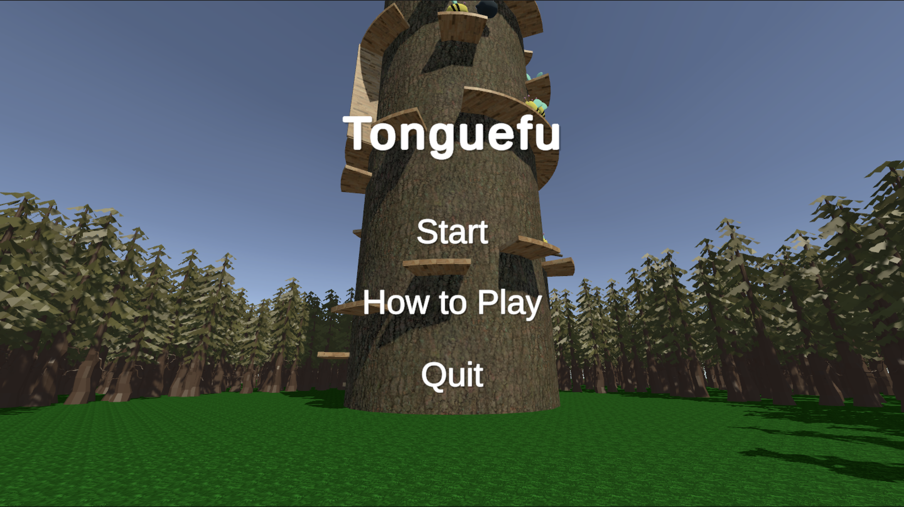
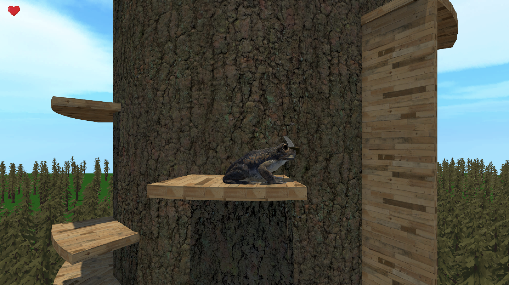
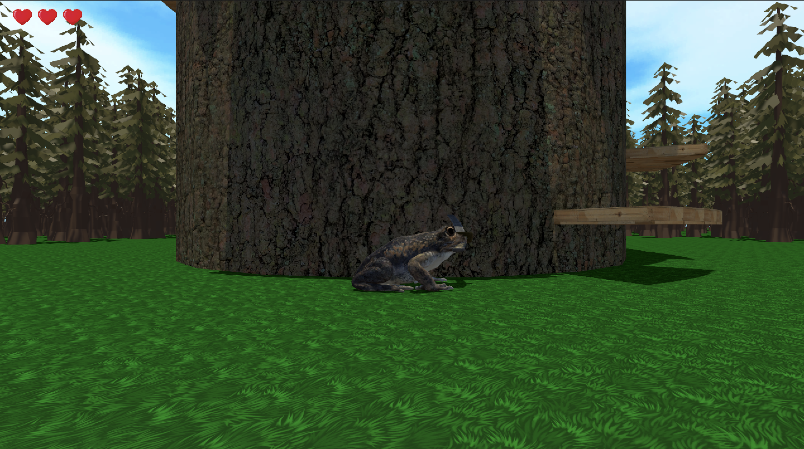
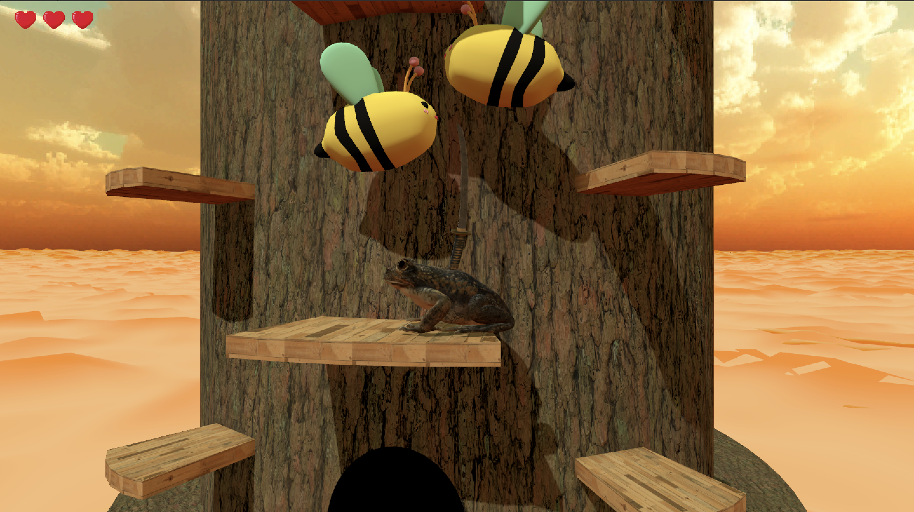
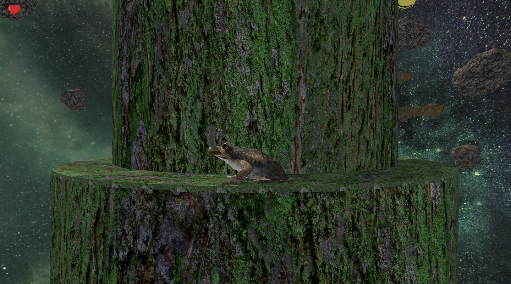
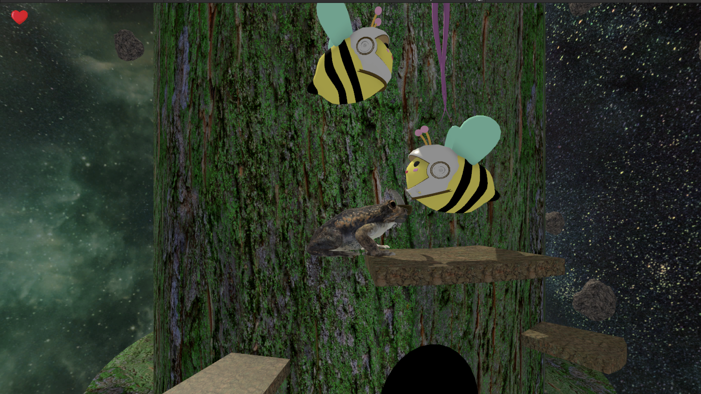
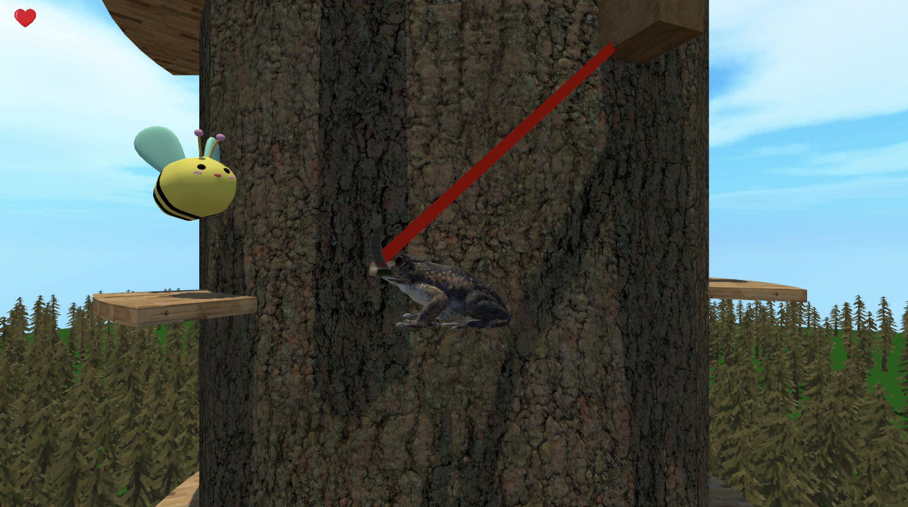
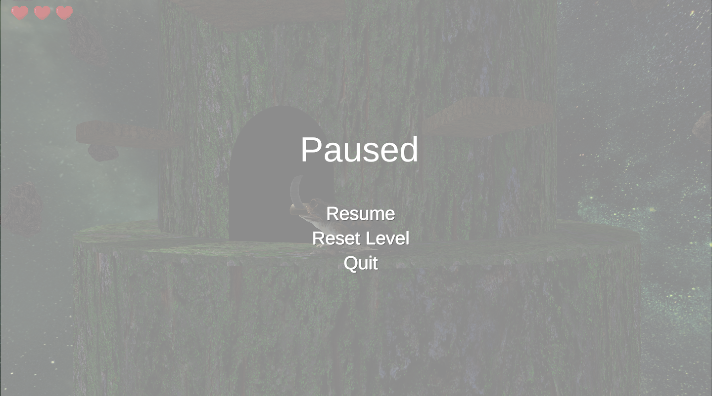

# Tonguefu

A 3D platformer game built in **Unity 3D and C#**, featuring a frog protagonist that climbs a towering tree while battling enemies along the way. The player must navigate challenging environments, defeat hostile creatures, and strategically use the frog’s abilities to reach the top of the tree.

---

## Screenshots

<table>
  <tr>
    <td align="center">
      
       <b>Main menu</b>
        
      
       <b>Level 1</b>
        
      
       <b>Enemies</b>
    </td>
    <td align="center">
      
       <b>Obstacles</b>
        
      
       <b>Visuals</b>
         
      
       <b>Level 3</b>
    </td>
    <td align="center">
      
       <b>Level 3 Visuals</b>
        
      
       <b>Grapple</b>
        
      
       <b>Pause Menu</b>
    </td>
  </tr>
</table>

---

## About the Game

In **Tonguefu**, players control a nimble frog that ascends a massive tree filled with obstacles and enemies. The goal is to **reach the top of the tree while defeating enemies along the way**. The game emphasizes precision movement, timing, and combat strategy.

---

## Gameplay Features

- **Dynamic Player Movement** – Jumping, climbing, and swinging between branches  
- **Tongue Mechanics** – Attack enemies and latch onto platforms  
- **Sword Combat** – Melee-based combat against various enemy types  
- **Life Collection System** – Players can collect extra lives when running low  
- **Multi-level Vertical Progression** – Tree-based level design with increasing difficulty  
- **Enemy AI Encounters** – Different enemies that challenge the player’s timing and positioning  

---

## Tech Stack

- **Engine:** Unity 3D  
- **Language:** C#  
- **Physics:** Unity Rigidbody & Colliders  
- **Animation:** Unity Animator Controller  
- **Gameplay Systems:** Custom player movement, combat, and level logic  

---

## My Contributions

On this semester-long college project, I worked as part of a four-person team and was responsible for:

- **Player Movement System** – Designed and implemented frog controls (jumping, swinging, and climbing mechanics)
- **Combat System** – Built melee sword mechanics and tongue-based attacks  
- **Animations** – Integrated and refined character animations using Unity Animator  
- **Level Design** – Designed sections of the tree-based levels to balance difficulty and fun  
- **Bug Fixing & Iteration** – Tested, debugged, and refined gameplay mechanics throughout development  

---

## How to Play (Controls)

*(You can modify this based on your actual controls if you remember them)*

- **Move:** WASD / Arrow Keys  
- **Jump:** Space  
- **Tongue Attack:** Left Mouse Button  
- **Sword Attack:** Right Mouse Button  

---

## Team

Developed in collaboration with three classmates as part of a college course in game development.

---

